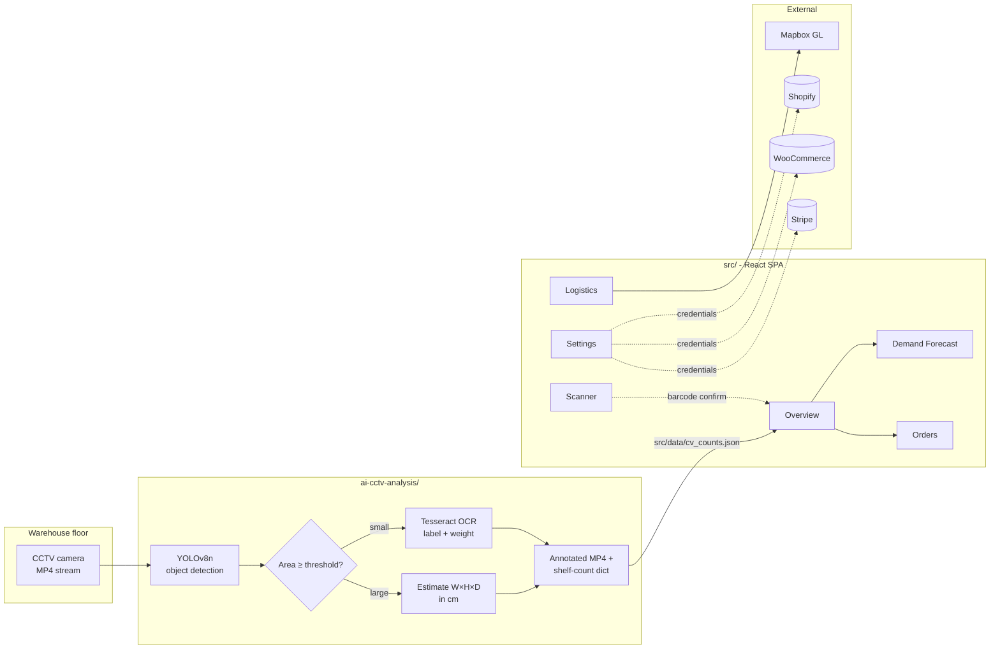

# SmartRetailFlow

**AI-powered retail warehouse inventory, logistics, and demand forecasting - paired with a CCTV computer-vision pipeline that counts what is actually on the shelves.**

[](https://react.dev)
[](https://www.typescriptlang.org)
[](https://vitejs.dev)
[](https://tailwindcss.com)
[](https://ui.shadcn.com)
[](https://docs.ultralytics.com)
[](https://github.com/tesseract-ocr/tesseract)
[](https://www.mapbox.com)

SmartRetailFlow is a two-part project that bridges the gap between a retail control tower and the floor that actually holds the stock. A React + TypeScript dashboard owns the inventory, forecasting, logistics, and order workflows; a Python pipeline owns the camera feed, detects crates and shelf items with YOLOv8, reads their labels with Tesseract OCR, and emits per-item running counts to annotated video.

It was built to test a single idea: **can a small ops team operate a warehouse with one browser tab and a CCTV camera, and still know what is in stock?**

---

## Highlights

**Frontend control tower** (`src/`)
- 6 first-class routes: Overview, Barcode Scanner, AI Demand Forecast, Delivery Logistics (Mapbox), Orders Management, Settings.
- Mobile-class delivery scanner using `@capacitor/camera` so the same code runs as a web SPA or wraps into a native shell.
- Demand-forecast view fed by a separate AI factors panel (holidays, weather, market trends) so the recommendation is auditable, not magic.
- Logistics view ships a Mapbox GL map, driver roster, traffic + weather widget, and a route optimiser side-by-side.
- Built on `shadcn/ui` (Radix primitives + TailwindCSS), TanStack Query for data fetching, Recharts for the trend curves, and `lucide-react` for the icon set.

**Computer-vision back end** (`ai-cctv-analysis/`)
- YOLOv8n detection on every frame of input MP4s.
- Size-based classification: any detection above `WAREHOUSE_AREA_THRESHOLD` pixels is treated as a warehouse crate (annotated blue, dimensions estimated W x H x D in cm); anything smaller is a shelf product (annotated green, OCR'd for label + weight).
- Tesseract OCR pass on each shelf-item ROI extracts the product label and the first `kg / g / ml / l` weight pattern it can find.
- Running tally per product (`+1, net: N`) so a single video produces a count table at the end.
- Emits `<video>_annotated.mp4` alongside the input - the visualisation is what the dashboard side will eventually consume.

---

## Architecture



> **Current state, in plain words.** The two halves are wired through a single JSON contract at [src/data/cv_counts.json](src/data/cv_counts.json). The CV pipeline's `write_dashboard_export()` writes shelf-item counts + warehouse-box detections after every video run; Vite imports that JSON at build time and [src/data/cv_counts.ts](src/data/cv_counts.ts) types it. [TopProductsCard](src/components/TopProductsCard.tsx) currently consumes it (showing a "Live from CCTV" badge when the JSON has rows; falling back to demo data otherwise) - other dashboard cards still render mocked data and are the next integration step. The Shopify / WooCommerce / Stripe tiles in `Settings` are UI scaffolding only - credentials are captured in component state but not wired to live APIs.

---

## Tech stack

### Frontend

| Layer | Choice |
| --- | --- |
| Framework | React 18, TypeScript |
| Build | Vite |
| Styling | TailwindCSS + `tailwindcss-animate` |
| Component primitives | `shadcn/ui` (Radix UI underneath) |
| Icons | `lucide-react` |
| Charts | `recharts` |
| Map | `mapbox-gl` |
| Data fetching | `@tanstack/react-query` |
| Routing | `react-router-dom` |
| Notifications | `sonner` |
| Mobile shell | `@capacitor/camera` for the barcode scanner |

### AI / Computer Vision

| Layer | Choice |
| --- | --- |
| Object detection | YOLOv8n via `ultralytics` |
| OCR | `pytesseract` wrapping system Tesseract |
| Video I/O | `opencv-python` |
| Numerics | `numpy`, `Pillow` |

### External services

| Service | Where it shows up |
| --- | --- |
| Mapbox GL | `src/pages/Logistics.tsx`, `src/components/DeliveryMap.tsx` |
| Shopify | `src/pages/Settings.tsx` (integration tile, UI only) |
| WooCommerce | `src/pages/Settings.tsx` (integration tile, UI only) |
| Stripe | `src/pages/Settings.tsx` (integration tile, UI only) |

---

## Run it locally

### Prerequisites

| Tool | Version |
| --- | --- |
| Node.js | >= 18.18 |
| npm / pnpm / bun | any recent |
| Python | >= 3.10 (only if running the CV pipeline) |
| Tesseract OCR | >= 5.x (only if running the CV pipeline) |
| GPU | Optional - YOLOv8n runs on CPU, just slower |

### Frontend (dashboard)

```bash
git clone git@github.com:trishnadas7897/warehouse-inventory-management.git
cd warehouse-inventory-management
npm install
npm run dev
```

The dev server prints a URL (typically `http://localhost:5173`).

**Mapbox token.** The Logistics page asks for your Mapbox token at runtime - paste it into the input field at the top of `/logistics`. Free tokens are available at [account.mapbox.com](https://account.mapbox.com/access-tokens/). The token never leaves the browser; it is stored in component state only.

### CV pipeline (CCTV analysis)

```bash
cd ai-cctv-analysis
python3 -m venv .venv && source .venv/bin/activate
pip install -r requirements.txt
python setup.py            # downloads yolov8n.pt + verifies Tesseract path
```

Install Tesseract for your OS:

| OS | Command |
| --- | --- |
| Windows | See [`install_tesseract.md`](./ai-cctv-analysis/install_tesseract.md) - installer from UB-Mannheim, default path |
| macOS | `brew install tesseract` |
| Ubuntu / Debian | `sudo apt install tesseract-ocr` |

Point the script at your video folder by editing `VIDEO_DIR` (and, on Windows, `pytesseract.pytesseract.tesseract_cmd`) at the top of `ai-cctv-analysis/video_processor.py`. Then:

```bash
python video_processor.py
```

Each MP4 in `VIDEO_DIR` produces a sibling `<name>_annotated.mp4`. The terminal prints a per-video shelf-count summary when the run finishes.

---

## Integration configuration

### Mapbox GL (Logistics map)

1. Sign up at [mapbox.com](https://mapbox.com) and create a public access token.
2. Open `/logistics` in the running app and paste the token into the field at the top of the page.
3. Want it pre-filled? Bind it to a `VITE_MAPBOX_TOKEN` env var and adjust `src/pages/Logistics.tsx` to seed `useState` from `import.meta.env.VITE_MAPBOX_TOKEN`.

### Shopify, WooCommerce, Stripe (planned)

`src/pages/Settings.tsx` currently surfaces three integration tiles with "connect" toggles. These are UI placeholders - they capture the credential shape (API key, store URL, webhook secret) but the actual API clients are not wired up. The intended integration model:

| Service | What we will exchange | Where it lives |
| --- | --- | --- |
| Shopify | OAuth code -> `Admin REST` orders + inventory levels | new `src/lib/integrations/shopify.ts` |
| WooCommerce | REST API key -> `wc/v3/products` + `wc/v3/orders` | new `src/lib/integrations/woocommerce.ts` |
| Stripe | secret key -> `Payments` + `Payouts` reconcile | new `src/lib/integrations/stripe.ts` |

A small adapter file per integration keeps the dashboard agnostic - each one returns a normalised `{ products[], orders[] }` shape that the existing dashboard components already render.

---

## Repository layout

```
warehouse-inventory-management/
+-- ai-cctv-analysis/
|   +-- README.md              CV-pipeline-specific guide
|   +-- install_tesseract.md   OS-by-OS Tesseract setup
|   +-- requirements.txt       ultralytics, opencv, pytesseract, numpy, Pillow
|   +-- setup.py               Env check + YOLO model download
|   +-- video_processor.py     YOLOv8 + OCR + annotation loop
+-- src/
|   +-- App.tsx                Router + sidebar shell
|   +-- pages/                 6 pages (Index, Scanner, Forecast, Logistics, Orders, Settings)
|   +-- components/            Feature components (DeliveryMap, BarcodeScanner, ...) + shadcn ui/
|   +-- hooks/                 use-toast, use-mobile
|   +-- lib/utils.ts           cn() class-merging helper
|   +-- index.css, App.css
+-- index.html
+-- README.md                  (this file)
+-- package.json
+-- vite.config.ts
+-- tailwind.config.js
+-- tsconfig.json
```

---

## Roadmap

The honest version, in order of impact:

1. **Pipeline -> dashboard wiring.** ✅ *In progress.* `video_processor.py::write_dashboard_export` writes a typed JSON contract at `src/data/cv_counts.json`; `TopProductsCard` consumes it. Next: thread the same import through `StockOverviewCards`, `StockAlertPanel`, and the forecast pages so every "stock" surface reads from real CCTV counts.
2. **Realtime barcode scan.** Today `BarcodeScanner.tsx` simulates a barcode in web mode. Wrap with Capacitor and ship a real native build that uses the device camera + an open-source barcode SDK.
3. **Forecast model.** The "AI Demand Forecast" surface is currently driven by mock series. Plug in a real model (Prophet / linear-regression baseline / a TimeSeries Transformer) keyed on historical orders + the holiday/weather signals already in `AIFactorsSidebar`.
4. **Live integrations.** Wire the Shopify / WooCommerce / Stripe tiles to real API clients with the adapter shape sketched above.
5. **Auth + multi-tenancy.** Add a simple auth surface (Clerk / Supabase Auth) and scope every dashboard route to a `store_id`.

---

## License

MIT. Compliance with YOLOv8 (AGPL by default unless you hold an Ultralytics commercial license) and Tesseract (Apache 2.0) applies to the CV side - check those licences before any commercial use.

---

## Contributors

Built for Walmart Sparkathon 2025.

- **[Trishna Das](https://github.com/trishnadas7897)** - React + TypeScript dashboard (Vite, Tailwind, shadcn/ui, 25 custom components, 6 routes), YOLOv8 + Tesseract CV pipeline, integration handoff layer.

Questions? Open an issue or reach out via the contact details on [trishnadas7897.github.io](https://trishnadas7897.github.io).
