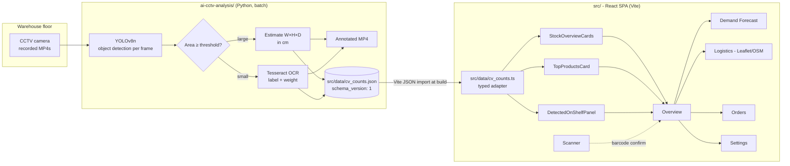

# SmartRetailFlow

**AI-powered retail warehouse inventory, logistics, and demand forecasting - paired with a CCTV computer-vision pipeline that counts what is actually on the shelves.**

> 🔗 **Live demo:** **https://warehouse-inventory-management-mocha.vercel.app** · needs **no API keys** to run or deploy.

[](https://react.dev)
[](https://www.typescriptlang.org)
[](https://vitejs.dev)
[](https://tailwindcss.com)
[](https://ui.shadcn.com)
[](https://docs.ultralytics.com)
[](https://github.com/tesseract-ocr/tesseract)
[](https://leafletjs.com)

SmartRetailFlow is a two-part project that bridges the gap between a retail control tower and the floor that actually holds the stock. A React + TypeScript dashboard owns the inventory, forecasting, logistics, and order workflows; a Python pipeline owns the camera feed, detects crates and shelf items with YOLOv8, reads their labels with Tesseract OCR, and emits per-item running counts that the dashboard reads through a typed JSON contract.

It was built to test a single idea: **can a small ops team operate a warehouse with one browser tab and a CCTV camera, and still know what is in stock?**

---

## Highlights

**Frontend control tower** (`src/`)
- 6 first-class routes: Overview, Barcode Scanner, AI Demand Forecast, Delivery Logistics, Orders Management, Settings.
- Headline KPI cards and a "Detected on Shelf" panel read **real CCTV counts** from the CV pipeline via a versioned JSON contract, with a "Live from CCTV" badge and a graceful demo-data fallback.
- Mobile-class delivery scanner using `@capacitor/camera` so the same code runs as a web SPA or wraps into a native shell.
- Demand-forecast view fed by a separate AI factors panel (holidays, weather, market trends) so the recommendation is auditable, not magic.
- Logistics view ships a **Leaflet + OpenStreetMap** map (no API token), driver roster, traffic + weather widget, and a route optimiser side-by-side.
- Built on `shadcn/ui` (Radix primitives + TailwindCSS), TanStack Query-ready data hooks, Recharts for the trend curves, and `lucide-react` for the icon set.

**Computer-vision back end** (`ai-cctv-analysis/`)
- YOLOv8n detection on every frame of input MP4s.
- Size-based classification: any detection above `WAREHOUSE_AREA_THRESHOLD` pixels is treated as a warehouse crate (annotated blue, dimensions estimated W x H x D in cm); anything smaller is a shelf product (annotated green, OCR'd for label + weight).
- Tesseract OCR pass on each shelf-item ROI extracts the product label and the first `kg / g / ml / l` weight pattern it can find.
- Running tally per product so a single video produces a count table at the end.
- Emits `<video>_annotated.mp4` **and** writes `src/data/cv_counts.json` (`schema_version: 1`) - the file the dashboard imports at build time.
- Every parameter (weights path, px-to-cm scale, area threshold, video dir, Tesseract binary, export path) is **environment-overridable**, so the pipeline runs from a clean clone on Linux, macOS, or Windows with no code edits.

---

## Architecture



> **Current state, in plain words.** The two halves are wired through a single JSON contract at [src/data/cv_counts.json](src/data/cv_counts.json). The CV pipeline's `write_dashboard_export()` writes shelf-item counts + warehouse-box detections after every video run; Vite imports that JSON at build time and [src/data/cv_counts.ts](src/data/cv_counts.ts) types it. [StockOverviewCards](src/components/StockOverviewCards.tsx), [TopProductsCard](src/components/TopProductsCard.tsx), and [DetectedOnShelfPanel](src/components/DetectedOnShelfPanel.tsx) consume it (showing a "Live from CCTV" badge / "source: CCTV" caption when the JSON has rows; falling back to demo data otherwise). It is a **batch handoff** - the pipeline runs over recorded MP4s, writes JSON, and Vite bakes it in at build time; it is not a live video stream. The Shopify / WooCommerce / Stripe tiles in `Settings` are UI scaffolding only.

---

## The CV -> dashboard contract

This is the strongest engineering seam in the repo: a single versioned JSON file is the only coupling between a Python process and a TypeScript app.

- **Producer:** [ai-cctv-analysis/video_processor.py](ai-cctv-analysis/video_processor.py) `::write_dashboard_export`
- **Consumer:** [src/data/cv_counts.ts](src/data/cv_counts.ts) (typed adapter + read helpers)
- **The TypeScript interfaces ARE the contract** - change a field on one side and you must change the other.

```jsonc
{
  "schema_version": 1,
  "generated_at": "2026-06-06T12:00:00Z",   // ISO-8601 UTC
  "source_video": "store_cam_01.mp4",
  "total_frames_processed": 5400,
  "fps": 30,
  "shelf_items":     [{ "label": "Whole Milk 1L", "count": 47, "last_seen_frame": 5392 }],
  "warehouse_boxes": [{ "label": "Box", "dimensions_cm": "60.0x40.0x30.0 cm", "detected_count": 4 }]
}
```

Read helpers exposed to the dashboard: `getCvCounts()`, `getTotalShelfItems()`, `getTotalWarehouseBoxes()`, `getTopShelfItems(n)`, `isCvCountsFresh(ms)`.

> **Honest note on the counts.** A shelf `count` is a *per-frame detection tally*, not a unique-carton count (an item visible for 47 frames counts 47). The dashboard labels this "Shelf Detections", not "Total Products", to avoid overstating what the CV measures.

---

## Tech stack

### Frontend

| Layer | Choice |
| --- | --- |
| Framework | React 18, TypeScript |
| Build | Vite |
| Styling | TailwindCSS + `tailwindcss-animate` |
| Component primitives | `shadcn/ui` (Radix UI underneath) |
| Icons | `lucide-react` |
| Charts | `recharts` |
| Map | `react-leaflet` + `leaflet` (OpenStreetMap tiles, no token) |
| Data fetching | `@tanstack/react-query` |
| Routing | `react-router-dom` |
| Notifications | `sonner` |
| Mobile shell | `@capacitor/camera` for the barcode scanner |

### AI / Computer Vision

| Layer | Choice |
| --- | --- |
| Object detection | YOLOv8n via `ultralytics` |
| OCR | `pytesseract` wrapping system Tesseract |
| Video I/O | `opencv-python` |
| Numerics | `numpy`, `Pillow` |

### External services

| Service | Where it shows up | Status |
| --- | --- | --- |
| OpenStreetMap (via Leaflet) | `src/components/DeliveryMap.tsx` | Live, no key required |
| Shopify | `src/pages/Settings.tsx` | Integration tile, UI only |
| WooCommerce | `src/pages/Settings.tsx` | Integration tile, UI only |
| Stripe | `src/pages/Settings.tsx` | Integration tile, UI only |

---

## Run it locally

### Prerequisites

| Tool | Version |
| --- | --- |
| Node.js | >= 18.18 |
| npm / pnpm / bun | any recent |
| Python | >= 3.10 (only if running the CV pipeline) |
| Tesseract OCR | >= 5.x (only if running the CV pipeline) |
| GPU | Optional - YOLOv8n runs on CPU, just slower |

### Frontend (dashboard)

```bash
git clone https://github.com/trishnadas7897/warehouse-inventory-management.git
cd warehouse-inventory-management
npm install
npm run dev
```

The dev server prints a URL (typically `http://localhost:5173`). **No tokens or env vars are required** - the logistics map uses OpenStreetMap tiles directly.

### CV pipeline (CCTV analysis)

```bash
cd ai-cctv-analysis
python3 -m venv .venv && source .venv/bin/activate
pip install -r requirements.txt
python setup.py            # downloads yolov8n.pt + verifies Tesseract
```

Install the Tesseract binary for your OS (the `pytesseract` pip package is only a wrapper):

| OS | Command |
| --- | --- |
| Ubuntu / Debian | `sudo apt-get install -y tesseract-ocr` |
| macOS | `brew install tesseract` |
| Windows | See [`install_tesseract.md`](./ai-cctv-analysis/install_tesseract.md) - then set `TESSERACT_CMD` to the install path |

Configure the run via environment variables (all have sensible defaults):

| Env var | Purpose | Default |
| --- | --- | --- |
| `CCTV_VIDEO_DIR` | folder of input `.mp4`s | (original dev path) |
| `YOLO_WEIGHTS` | detector weights | `yolov8n.pt` |
| `PIXEL_TO_CM` | px-to-cm scale for box dims | `0.1` |
| `WAREHOUSE_AREA_THRESHOLD` | box-vs-shelf split (px^2) | `50000` |
| `DASHBOARD_EXPORT_PATH` | JSON output path | `../src/data/cv_counts.json` |
| `TESSERACT_CMD` | Tesseract binary path (Windows only; PATH is used otherwise) | _unset_ |

```bash
export CCTV_VIDEO_DIR="$(pwd)/sample_videos"     # drop your MP4s here
mkdir -p sample_videos
python video_processor.py
```

Each MP4 in `CCTV_VIDEO_DIR` produces a sibling `<name>_annotated.mp4` and refreshes `src/data/cv_counts.json`. Rebuild the frontend (`npm run build`) to pick up the new counts.

---

## Deploy to Vercel

The build is fully static and **needs no environment variables**.

1. Vercel -> **Add New -> Project** -> import `warehouse-inventory-management`.
2. **Root Directory:** repo root · **Framework:** Vite · **Build:** `npm run build` · **Output:** `dist`.
3. Deploy, then paste the URL into the **Live demo** line at the top of this README.

A [`vercel.json`](vercel.json) is included with a SPA rewrite (`/(.*) -> /index.html`) so deep links and hard refreshes on client-side routes (`/forecast`, `/logistics`, ...) resolve correctly on the static host.

CLI alternative:

```bash
npm i -g vercel
vercel login
vercel --prod        # from the repo root
```

---

## Integration configuration

### Logistics map (Leaflet + OpenStreetMap)

No configuration. The map renders from public OpenStreetMap tiles with no token. To swap in a different tile provider, edit the `<TileLayer url=...>` in `src/components/DeliveryMap.tsx`.

### Shopify, WooCommerce, Stripe (planned)

`src/pages/Settings.tsx` currently surfaces three integration tiles (Shopify, WooCommerce, Stripe). These are static UI placeholders - a label and a connect/status badge per service; there are no credential fields and no API clients wired up yet. The intended integration model:

| Service | What we will exchange | Where it lives |
| --- | --- | --- |
| Shopify | OAuth code -> `Admin REST` orders + inventory levels | new `src/lib/integrations/shopify.ts` |
| WooCommerce | REST API key -> `wc/v3/products` + `wc/v3/orders` | new `src/lib/integrations/woocommerce.ts` |
| Stripe | secret key -> `Payments` + `Payouts` reconcile | new `src/lib/integrations/stripe.ts` |

A small adapter file per integration keeps the dashboard agnostic - each one returns a normalised `{ products[], orders[] }` shape that the existing dashboard components already render.

---

## Repository layout

```
warehouse-inventory-management/
+-- ai-cctv-analysis/
|   +-- README.md              CV-pipeline-specific guide
|   +-- install_tesseract.md   OS-by-OS Tesseract setup
|   +-- requirements.txt       ultralytics, opencv, pytesseract, numpy, Pillow
|   +-- setup.py               Env check + YOLO model download (cross-platform)
|   +-- video_processor.py     YOLOv8 + OCR + annotation + JSON export
+-- src/
|   +-- App.tsx                Router + sidebar shell
|   +-- pages/                 6 pages (Index, Scanner, Forecast, Logistics, Orders, Settings)
|   +-- components/            Feature components (DeliveryMap, BarcodeScanner, ...) + shadcn ui/
|   +-- data/                  cv_counts.ts (+ .json) - the CV handoff contract
|   +-- hooks/                 use-toast, use-mobile
|   +-- lib/utils.ts           cn() class-merging helper
|   +-- index.css, App.css
+-- index.html
+-- vercel.json                SPA rewrite for client-side routing
+-- README.md                  (this file)
+-- package.json
+-- vite.config.ts
+-- tailwind.config.js
+-- tsconfig.json
```

---

## Roadmap

The honest version, in order of impact:

1. **Pipeline -> dashboard wiring.** ✅ *Done.* `write_dashboard_export` writes a typed JSON contract at `src/data/cv_counts.json`; `StockOverviewCards`, `TopProductsCard`, and `DetectedOnShelfPanel` all consume it. Next: thread it through `StockAlertPanel` and the forecast pages too.
2. **Live (streaming) handoff.** Today the pipeline is batch over recorded MP4s and the dashboard reads JSON baked in at build time. Next step is a websocket / polling bridge so counts update without a rebuild.
3. **Realtime barcode scan.** Today `BarcodeScanner.tsx` simulates a barcode in web mode. Wrap with Capacitor and ship a real native build that uses the device camera + an open-source barcode SDK.
4. **Forecast model.** The "AI Demand Forecast" surface is currently driven by mock series. Plug in a real model (Prophet / linear-regression baseline / a TimeSeries Transformer) keyed on historical orders + the holiday/weather signals already in `AIFactorsSidebar`.
5. **Live integrations.** Wire the Shopify / WooCommerce / Stripe tiles to real API clients with the adapter shape sketched above.

---

## License

MIT. Compliance with YOLOv8 (AGPL by default unless you hold an Ultralytics commercial license) and Tesseract (Apache 2.0) applies to the CV side - check those licences before any commercial use.

---

## Contributors

Built for Walmart Sparkathon 2025.

- **[Trishna Das](https://github.com/trishnadas7897)** - React + TypeScript dashboard (Vite, Tailwind, shadcn/ui, 25+ custom components, 6 routes), YOLOv8 + Tesseract CV pipeline, and the typed JSON integration handoff between them.

Questions? Open an issue or reach out via the contact details on [trishnadas7897.github.io](https://trishnadas7897.github.io).
